# Onsumm Platform — Data Model & State Machines

| | |
|---|---|
| **Document** | 04 — Data Model |
| **As of** | 2026-10-31 (commit `6e1278f`) |
| **Database** | PostgreSQL 15 (AWS RDS), one shared database for API, pipeline and Nova service |
| **Related** | [01 HLD](01_HLD.md) · [02 LLD](02_LLD.md) · [03 User Flows](03_USER_FLOWS.md) |

---

## Table of contents

1. [Where the schema is defined](#1-where-the-schema-is-defined)
2. [Naming conventions and layers](#2-naming-conventions-and-layers)
3. [Table catalogue by domain](#3-table-catalogue-by-domain)
4. [ER diagrams](#4-er-diagrams)
5. [State machines](#5-state-machines)
6. [Event triggers (LISTEN/NOTIFY)](#6-event-triggers-listennotify)
7. [Multi-tenancy in the data layer](#7-multi-tenancy-in-the-data-layer)
8. [Known data-model issues](#8-known-data-model-issues)

---

## 1. Where the schema is defined

`docs/full_database_schema.md` was pulled from live RDS but is **not exhaustive** — it omits Review Hub, agent, crypto, audit-anchor and comm tables. The authoritative DDL sources are:

| Source | Defines |
|---|---|
| `backend_ocr/app/migrations.py` (31 steps, `scripts/run_api_migrations.py`) | `bill_approval_chain`, `tenant_chain_config`, `supplier_bank_accounts`, `supplier_contacts`, `supplier_gstins`, `supplier_gstns` (legacy), `vendor_outreach_log`, `dim_charges`, `ledger_mapping_log`, `coa_rules`, `dim_categories`, `vendor_documents`, `vendor_logos`, `brands`, `cost_centers`, `vendor_activity_log`, `auth_refresh_tokens`, `bill_attachments`; extra columns on `fact_invoices`, `stg_bills`; approval values on `invoice_status` |
| `backend_ocr/app/crypto_migrations.py` | All crypto tables; crypto columns on `dim_tenants`, `dim_suppliers`, `fact_disbursements` |
| `backend_ocr/app/audit_migrations.py` | Hash-chain columns on `wf_audit_log`, `tenant_audit_salts`, `audit_anchors`, `audit_anchor_tenant_roots`, trigger `trg_wf_audit_hash_chain` |
| `scripts/review_hub_migrate.py` | `rh_*` (9 tables) |
| `scripts/agent_runtime_migrate.py` | `agent_registry`, `agent_runs`, `agent_budgets` |
| `scripts/comm_agent_migrate.py` | `comm_thread_state`, `comm_extractions` |
| `scripts/billing_reconciliation_migrate*.py` | `billing_*` tables and enums |
| `scripts/fx_migrate.py` | `dim_currencies`, `dim_fx_rates`, `fx_bill_payments`, `fx_rate_alerts`, `fx_agent_notes` |
| `scripts/sap_catalog_migrate.py` | `sap_item_*`, `mapping_review_queue` |
| `security/licensing_schema.py`, `scripts/licensing_migrate.py` | `service_catalog`, `tenant_service`, `service_package(_item)`, `platform_*`, `tenant_usage`, `admin_audit_log` |
| Routers that create tables on import | `disbursement.py` (`remitter_accounts`, `fact_disbursements`, `disbursement_overrides`, `disbursement_gateway_calls`), `agent.py` (`agent_settings`, `agent_draft_bills`, `agent_email_events`), `sso.py` (`auth_sso_codes`), `settings.py` (`tenant_priority_labels`), `email_connection.py` (`user_email_connections`), `domain/fact_graph.py` (`fact_graph_nodes/edges`) |
| `backend_ocr/app/sql/nova_credentials.sql` | `int_nova_credentials` |
| `pipelines/cdc.py` | All NOTIFY triggers |

> **Key modelling fact:** AP bills live in **`fact_invoices` with `invoice_type = 'AP'`**. The UI, approval chain, payments and Review Hub all read `fact_invoices`. `fact_bills` is filled only by the staging promotion pipeline and is not the bill of record.

---

## 2. Naming conventions and layers

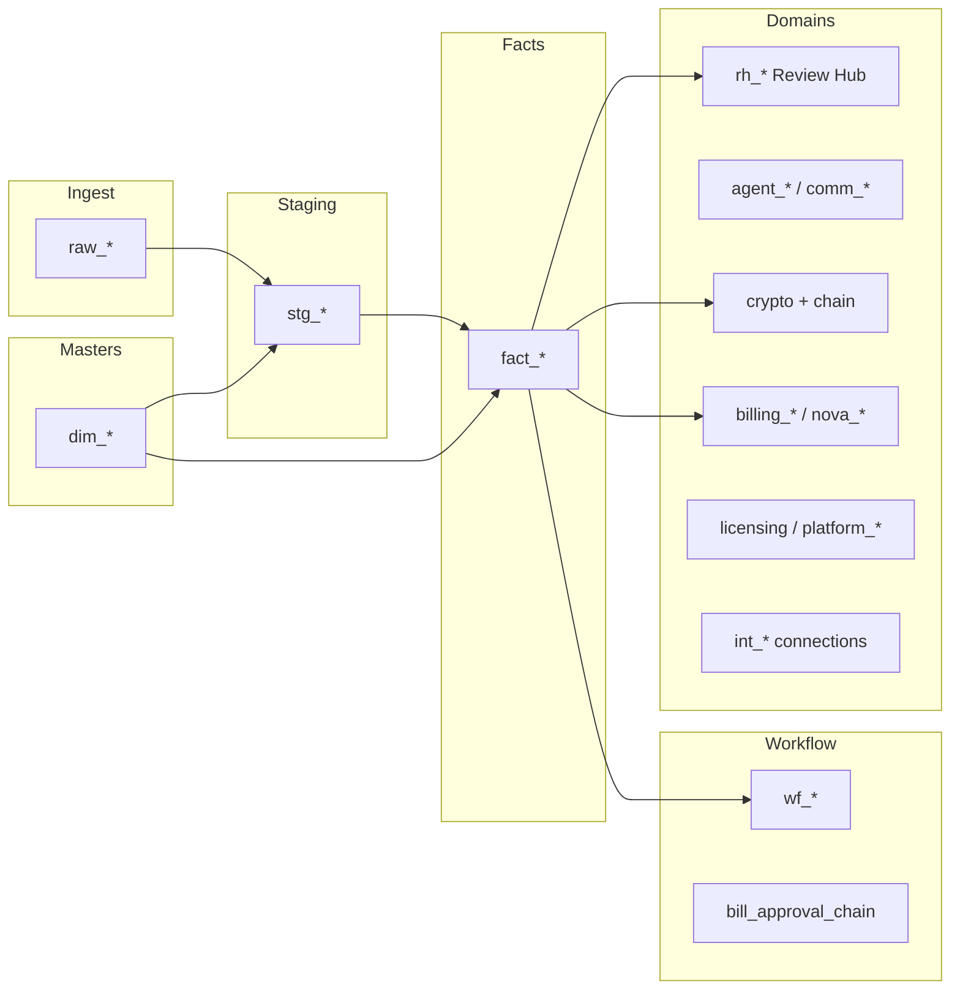
```mermaid
flowchart LR
    subgraph Ingest
        RAW[raw_*]
    end
    subgraph Staging
        STG[stg_*]
    end
    subgraph Facts
        FACT[fact_*]
    end
    subgraph Masters
        DIM[dim_*]
    end
    subgraph Workflow
        WF[wf_*]
        BAC[bill_approval_chain]
    end
    subgraph Domains
        RH[rh_* Review Hub]
        AG[agent_* / comm_*]
        CR[crypto + chain]
        BIL[billing_* / nova_*]
        LIC[licensing / platform_*]
        INT[int_* connections]
    end
    RAW --> STG --> FACT
    DIM --> STG
    DIM --> FACT
    FACT --> WF
    FACT --> RH
    FACT --> CR
    FACT --> BIL
```

| Prefix | Meaning | Mutability |
|---|---|---|
| `raw_` | As received from upload, API, webhook | Append-only |
| `stg_` | Parsed and validated, before promotion | Updated by workers |
| `fact_` | Business records of truth | Updated by API + workers |
| `dim_` | Master data | Updated by users + KYB |
| `wf_` | Workflow tasks, nudges, escalations, audit | `wf_audit_log` append-only, hash-chained |
| `int_` | External connection state | Credentials encrypted |
| `ai_` | Anomalies, risk scores, predictions | Workers |
| `rh_` | Review Hub findings and audit | `store.py` is the only writer of `rh_findings` |

---

## 3. Table catalogue by domain

| Domain | Tables |
|---|---|
| **Ingest** | `raw_invoice_uploads`, `raw_ocr_results`, `raw_api_payloads`, `raw_webhook_events`, `raw_ingestion_errors` |
| **Staging** | `stg_bills`, `stg_bill_line_items`, `stg_invoices`, `stg_invoice_line_items`, `stg_payments`, `stg_credit_notes`, `stg_bank_statements`, `stg_journal_entries`, `stg_journal_entry_lines` |
| **Facts** | `fact_invoices`, `fact_bills`, `fact_payments`, `fact_disbursements`, `fact_cashflow_daily`, `fact_tds_ledger`, `fact_graph_nodes`, `fact_graph_edges` |
| **Masters** | `dim_tenants`, `dim_suppliers`, `dim_end_customers`, `dim_end_customer_contacts`, `dim_customers`, `dim_ledger_accounts`, `dim_cost_centres`, `dim_products`, `dim_tax_rates`, `dim_bank_accounts`, `dim_categories`, `dim_charges`, `dim_currencies`, `dim_fx_rates`, `dim_vendor_categories`, `dim_tds_sections`, `dim_tds_mapping_rules`, `dim_vendor_tds_overrides` |
| **Vendor satellites** | `supplier_bank_accounts`, `supplier_contacts`, `supplier_gstins`, `supplier_gstns` (legacy), `vendor_documents`, `vendor_doc_edits`, `vendor_logos`, `vendor_activity_log`, `vendor_tds_fy_state`, `vendor_tds_config_log`, `vendor_outreach_log` |
| **Bill satellites** | `bill_approval_chain`, `bill_attachments`, `bill_attachment_edits`, `ledger_mapping_log`, `mapping_review_queue` |
| **Org / config** | `brands`, `cost_centers`, `tenant_chain_config`, `tenant_priority_labels`, `coa_rules` |
| **Identity** | `users`, `auth_refresh_tokens`, `auth_sso_codes`, `org_users`, `org_user_access_levels`, `user_email_connections` |
| **Workflow & audit** | `wf_tasks`, `wf_nudges`, `wf_escalations`, `wf_audit_log` |
| **INR disbursement** | `fact_disbursements`, `disbursement_overrides`, `disbursement_gateway_calls`, `remitter_accounts`; legacy `payment_schedules`, `payment_transactions` |
| **Crypto rail** | `tenant_rail_policy`, `tenant_ubos`, `treasury_wallets`, `supplier_wallets`, `wallet_screenings`, `vendor_portal_nonces`, `vendor_contract_rates`, `fx_snapshots`, `crypto_disbursement_details`, `crypto_payout_signatures`, `crypto_withholdings`, `withholding_remittances`, `chain_transfers`, `chain_watch_cursors`, `ledger_postings` |
| **Audit anchoring** | `tenant_audit_salts`, `audit_anchors`, `audit_anchor_tenant_roots` |
| **Review Hub** | `rh_findings`, `rh_finding_entities`, `rh_finding_events`, `rh_finding_types`, `rh_suppressions`, `rh_review_requests`, `rh_finding_rejects`, `rh_undo_tokens`, `rh_audit_log` |
| **Agents** | `agent_registry`, `agent_runs`, `agent_budgets`, `agent_settings`, `agent_draft_bills`, `agent_email_events` |
| **Communication** | `comm_thread_state`, `comm_extractions`, `poc_email_messages` |
| **Integrations** | `int_connections`, `int_sync_log`, `int_conflict_log`, `int_field_mappings`, `int_connector_limits`, `int_nova_credentials` |
| **Nova / billing** | `billing_vendor_accounts`, `billing_vendor_module_alias`, `billing_vendor_invoices`, `billing_vendor_invoice_lines`, `billing_nova_usage_snapshots`, `billing_nova_usage_lines`, `billing_reconciliation_runs`, `billing_reconciliation_discrepancies`, `billing_bill_reconciliation`; service-owned `nova_reconciliation_runs`, `_lines`, `_bill_queue`, `_module_aliases` |
| **FX** | `fx_bill_payments`, `fx_rate_alerts`, `fx_agent_notes` |
| **SAP** | `sap_item_catalog`, `sap_item_embeddings`, `sap_item_aliases`, `sap_item_vendors` |
| **AI** | `ai_anomalies`, `ai_risk_scores`, `ai_payment_predictions` |
| **Licensing & platform** | `service_catalog`, `tenant_service`, `service_package`, `service_package_item`, `tenant_usage`, `platform_users`, `platform_refresh_tokens`, `platform_impersonation`, `admin_audit_log`, `schema_migrations` |

---

## 4. ER diagrams

> Relationships drawn with a dotted line (`..`) are **logical** (join key used in code, no FK constraint). Solid lines (`--`) are real foreign keys.

### 4.1 Core AP: tenant, vendor, bill

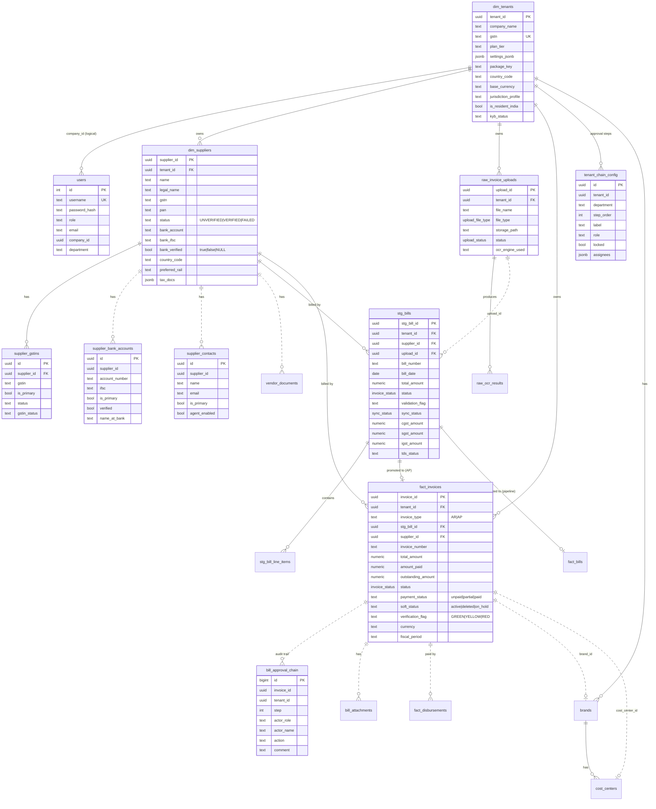
```mermaid
erDiagram
    dim_tenants ||--o{ users : "company_id (logical)"
    dim_tenants ||--o{ dim_suppliers : owns
    dim_tenants ||--o{ raw_invoice_uploads : owns
    dim_tenants ||--o{ fact_invoices : owns
    dim_tenants ||--o{ tenant_chain_config : "approval steps"
    dim_tenants ||--o{ brands : has
    brands ||--o{ cost_centers : has

    dim_suppliers ||--o{ supplier_gstins : has
    dim_suppliers ||..o{ supplier_bank_accounts : has
    dim_suppliers ||..o{ supplier_contacts : has
    dim_suppliers ||..o{ vendor_documents : has
    dim_suppliers ||--o{ stg_bills : "billed by"
    dim_suppliers ||--o{ fact_invoices : "billed by"

    raw_invoice_uploads ||--o{ raw_ocr_results : produces
    raw_invoice_uploads ||..o{ stg_bills : "upload_id"
    stg_bills ||--o{ stg_bill_line_items : contains
    stg_bills ||--o| fact_invoices : "promoted to (AP)"
    stg_bills ||--o| fact_bills : "promoted to (pipeline)"

    fact_invoices ||..o{ bill_approval_chain : "audit trail"
    fact_invoices ||..o{ bill_attachments : has
    fact_invoices ||..o{ fact_disbursements : "paid by"
    fact_invoices ||..o| brands : "brand_id"
    fact_invoices ||..o| cost_centers : "cost_center_id"

    dim_tenants {
        uuid tenant_id PK
        text company_name
        text gstn UK
        text plan_tier
        jsonb settings_jsonb
        text package_key
        text country_code
        text base_currency
        text jurisdiction_profile
        bool is_resident_india
        text kyb_status
    }
    users {
        int id PK
        text username UK
        text password_hash
        text role
        text email
        uuid company_id
        text department
    }
    dim_suppliers {
        uuid supplier_id PK
        uuid tenant_id FK
        text name
        text legal_name
        text gstn
        text pan
        text status "UNVERIFIED|VERIFIED|FAILED"
        text bank_account
        text bank_ifsc
        bool bank_verified "true|false|NULL"
        text country_code
        text preferred_rail
        jsonb tax_docs
    }
    supplier_gstins {
        uuid id PK
        uuid supplier_id FK
        text gstin
        bool is_primary
        text status
        text gstin_status
    }
    supplier_bank_accounts {
        uuid id PK
        uuid supplier_id
        text account_number
        text ifsc
        bool is_primary
        bool verified
        text name_at_bank
    }
    supplier_contacts {
        uuid id PK
        uuid supplier_id
        text name
        text email
        bool is_primary
        bool agent_enabled
    }
    raw_invoice_uploads {
        uuid upload_id PK
        uuid tenant_id FK
        text file_name
        upload_file_type file_type
        text storage_path
        upload_status status
        text ocr_engine_used
    }
    stg_bills {
        uuid stg_bill_id PK
        uuid tenant_id FK
        uuid supplier_id FK
        uuid upload_id FK
        text bill_number
        date bill_date
        numeric total_amount
        invoice_status status
        text validation_flag
        sync_status sync_status
        numeric cgst_amount
        numeric sgst_amount
        numeric igst_amount
        text tds_status
    }
    fact_invoices {
        uuid invoice_id PK
        uuid tenant_id FK
        text invoice_type "AR|AP"
        uuid stg_bill_id FK
        uuid supplier_id FK
        text invoice_number
        numeric total_amount
        numeric amount_paid
        numeric outstanding_amount
        invoice_status status
        text payment_status "unpaid|partial|paid"
        text soft_status "active|deleted|on_hold"
        text verification_flag "GREEN|YELLOW|RED"
        text currency
        text fiscal_period
    }
    bill_approval_chain {
        bigint id PK
        uuid invoice_id
        uuid tenant_id
        int step
        text actor_role
        text actor_name
        text action
        text comment
    }
    tenant_chain_config {
        uuid id PK
        uuid tenant_id
        text department
        int step_order
        text label
        text role
        bool locked
        jsonb assignees
    }
```

### 4.2 INR disbursement

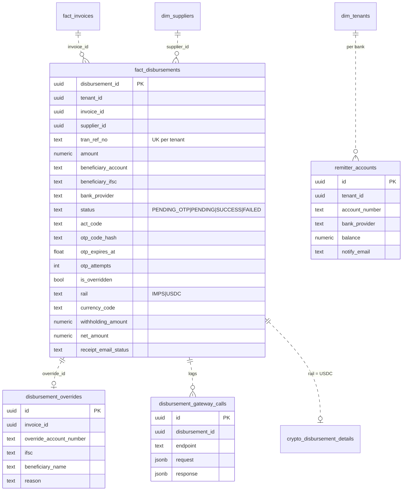
```mermaid
erDiagram
    fact_invoices ||..o{ fact_disbursements : "invoice_id"
    dim_suppliers ||..o{ fact_disbursements : "supplier_id"
    fact_disbursements ||..o| disbursement_overrides : "override_id"
    fact_disbursements ||..o{ disbursement_gateway_calls : logs
    dim_tenants ||..o{ remitter_accounts : "per bank"
    fact_disbursements ||..o| crypto_disbursement_details : "rail = USDC"

    fact_disbursements {
        uuid disbursement_id PK
        uuid tenant_id
        uuid invoice_id
        uuid supplier_id
        text tran_ref_no "UK per tenant"
        numeric amount
        text beneficiary_account
        text beneficiary_ifsc
        text bank_provider
        text status "PENDING_OTP|PENDING|SUCCESS|FAILED"
        text act_code
        text otp_code_hash
        float otp_expires_at
        int otp_attempts
        bool is_overridden
        text rail "IMPS|USDC"
        text currency_code
        numeric withholding_amount
        numeric net_amount
        text receipt_email_status
    }
    disbursement_overrides {
        uuid id PK
        uuid invoice_id
        text override_account_number
        text ifsc
        text beneficiary_name
        text reason
    }
    disbursement_gateway_calls {
        uuid id PK
        uuid disbursement_id
        text endpoint
        jsonb request
        jsonb response
    }
    remitter_accounts {
        uuid id PK
        uuid tenant_id
        text account_number
        text bank_provider
        numeric balance
        text notify_email
    }
```

### 4.3 Crypto rail (international USDC)

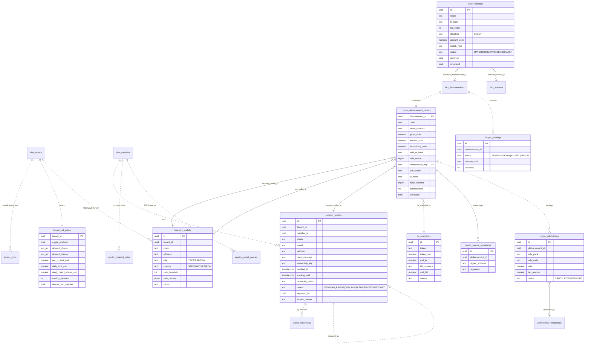
```mermaid
erDiagram
    dim_tenants ||..o{ tenant_ubos : "beneficial owners"
    dim_tenants ||..|| tenant_rail_policy : policy
    dim_tenants ||..o{ treasury_wallets : "TREASURY / TAX"
    dim_suppliers ||..o{ supplier_wallets : has
    supplier_wallets ||..o{ wallet_screenings : "by address"
    supplier_wallets ||..o| supplier_wallets : "replaced_by"
    dim_suppliers ||..o{ vendor_contract_rates : "contract rates"
    dim_suppliers ||..o{ vendor_portal_nonces : "SIWE nonces"

    fact_disbursements ||..|| crypto_disbursement_details : "shared PK"
    crypto_disbursement_details }o--|| treasury_wallets : "treasury_wallet_id"
    crypto_disbursement_details }o--o| treasury_wallets : "tax_wallet_id"
    crypto_disbursement_details }o--|| supplier_wallets : "supplier_wallet_id"
    crypto_disbursement_details }o--|| fx_snapshots : "fx_snapshot_id"
    crypto_disbursement_details ||--o{ crypto_payout_signatures : "owner sigs"
    crypto_disbursement_details ||..o{ crypto_withholdings : "tax legs"
    crypto_withholdings }o--o| withholding_remittances : "remittance_id"
    chain_transfers }o..o| fact_disbursements : "matched_disbursement_id"
    chain_transfers }o..o| fact_invoices : "matched_invoice_id"
    fact_disbursements ||..o{ ledger_postings : "voucher"

    tenant_rail_policy {
        uuid tenant_id PK
        bool crypto_enabled
        text_arr allowed_chains
        text_arr allowed_tokens
        numeric per_tx_limit_usd
        numeric daily_limit_usd
        numeric dual_control_above_usd
        int cooling_minutes
        bool require_test_transfer
    }
    treasury_wallets {
        uuid id PK
        uuid tenant_id
        text chain
        text address
        text role "TREASURY|TAX"
        text custody "SAFE|PARTNER|EOA"
        int safe_threshold
        jsonb safe_owners
        text status
    }
    supplier_wallets {
        uuid id PK
        uuid tenant_id
        uuid supplier_id
        text chain
        text asset
        text address
        text siwe_message
        text ownership_sig
        timestamptz verified_at
        timestamptz cooling_until
        text screening_status
        text status "PENDING_PROOF|COOLING|ACTIVE|FROZEN|REVOKED"
        uuid replaced_by
        text frozen_reason
    }
    fx_snapshots {
        uuid id PK
        text token
        numeric token_usd
        numeric usd_inr
        text bill_currency
        numeric usd_bill
        text source
    }
    crypto_disbursement_details {
        uuid disbursement_id PK
        text chain
        text token_contract
        numeric gross_units
        numeric amount_units
        numeric withholding_units
        text safe_tx_hash
        bigint safe_nonce
        text idempotency_key UK
        text sub_status
        text tx_hash
        bigint block_number
        int confirmations
        bool simulated
    }
    crypto_payout_signatures {
        uuid id PK
        uuid disbursement_id
        text signer_address
        text signature
    }
    crypto_withholdings {
        uuid id PK
        uuid disbursement_id
        text rule_pack
        text rule_code
        numeric rate
        numeric tax_amount
        text status "CALCULATED|WITHHELD"
    }
    chain_transfers {
        uuid id PK
        text chain
        text tx_hash
        int log_index
        text direction "IN|OUT"
        numeric amount_units
        text match_type
        text status "MATCHED|UNMATCHED|MISMATCH"
        bool removed
        bool simulated
    }
    ledger_postings {
        uuid id PK
        uuid disbursement_id
        text status "PENDING|READY|POSTED|ERROR"
        text voucher_xml
        int attempts
    }
```

### 4.4 Audit chain and anchoring

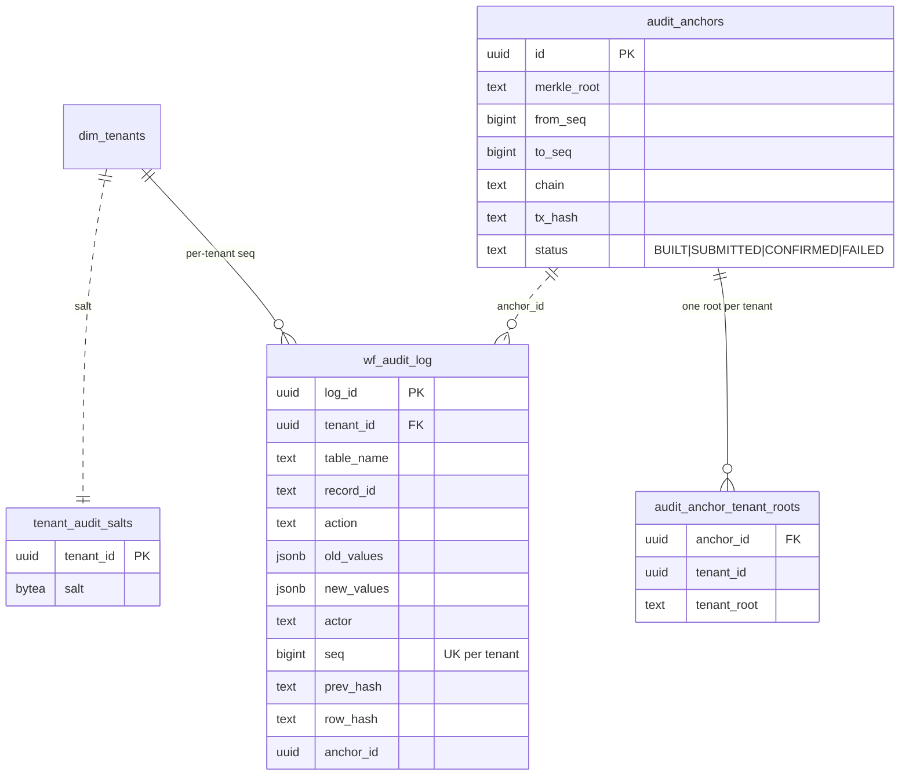
```mermaid
erDiagram
    dim_tenants ||--o{ wf_audit_log : "per-tenant seq"
    dim_tenants ||..|| tenant_audit_salts : salt
    audit_anchors ||--o{ audit_anchor_tenant_roots : "one root per tenant"
    audit_anchors ||..o{ wf_audit_log : "anchor_id"

    wf_audit_log {
        uuid log_id PK
        uuid tenant_id FK
        text table_name
        text record_id
        text action
        jsonb old_values
        jsonb new_values
        text actor
        bigint seq "UK per tenant"
        text prev_hash
        text row_hash
        uuid anchor_id
    }
    audit_anchors {
        uuid id PK
        text merkle_root
        bigint from_seq
        bigint to_seq
        text chain
        text tx_hash
        text status "BUILT|SUBMITTED|CONFIRMED|FAILED"
    }
    audit_anchor_tenant_roots {
        uuid anchor_id FK
        uuid tenant_id
        text tenant_root
    }
    tenant_audit_salts {
        uuid tenant_id PK
        bytea salt
    }
```

### 4.5 Review Hub and agents

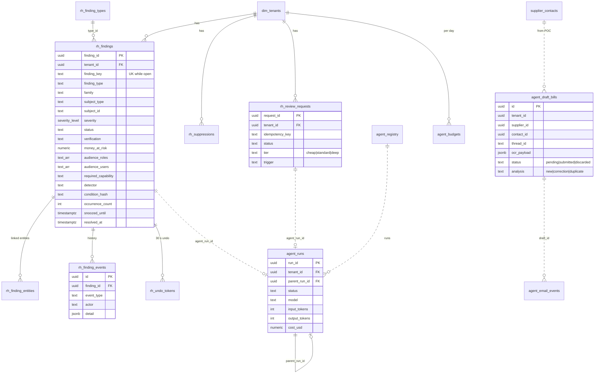
```mermaid
erDiagram
    dim_tenants ||--o{ rh_findings : has
    rh_finding_types ||--o{ rh_findings : "type_id"
    rh_findings ||--o{ rh_finding_entities : "linked entities"
    rh_findings ||--o{ rh_finding_events : history
    rh_findings ||--o{ rh_undo_tokens : "30 s undo"
    dim_tenants ||--o{ rh_suppressions : has
    dim_tenants ||--o{ rh_review_requests : has
    rh_review_requests ||..o| agent_runs : "agent_run_id"
    rh_findings ||..o| agent_runs : "agent_run_id"
    agent_runs ||--o| agent_runs : "parent_run_id"
    agent_registry ||..o{ agent_runs : runs
    dim_tenants ||--o{ agent_budgets : "per day"
    supplier_contacts ||..o{ agent_draft_bills : "from POC"
    agent_draft_bills ||..o{ agent_email_events : "draft_id"

    rh_findings {
        uuid finding_id PK
        uuid tenant_id FK
        text finding_key "UK while open"
        text finding_type
        text family
        text subject_type
        text subject_id
        severity_level severity
        text status
        text verification
        numeric money_at_risk
        text_arr audience_roles
        text_arr audience_users
        text required_capability
        text detector
        text condition_hash
        int occurrence_count
        timestamptz snoozed_until
        timestamptz resolved_at
    }
    rh_finding_events {
        uuid id PK
        uuid finding_id FK
        text event_type
        text actor
        jsonb detail
    }
    rh_review_requests {
        uuid request_id PK
        uuid tenant_id FK
        text idempotency_key
        text status
        text tier "cheap|standard|deep"
        text trigger
    }
    agent_runs {
        uuid run_id PK
        uuid tenant_id FK
        uuid parent_run_id FK
        text status
        text model
        int input_tokens
        int output_tokens
        numeric cost_usd
    }
    agent_draft_bills {
        uuid id PK
        uuid tenant_id
        uuid supplier_id
        uuid contact_id
        text thread_id
        jsonb ocr_payload
        text status "pending|submitted|discarded"
        text analysis "new|correction|duplicate"
    }
```

### 4.6 Licensing and platform admin

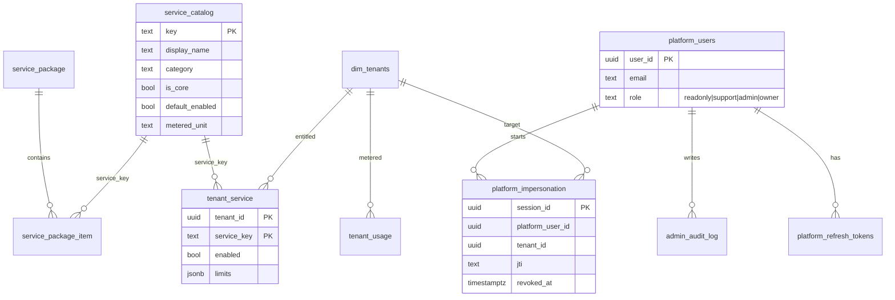
```mermaid
erDiagram
    service_catalog ||--o{ tenant_service : "service_key"
    dim_tenants ||--o{ tenant_service : entitled
    service_package ||--o{ service_package_item : contains
    service_catalog ||--o{ service_package_item : "service_key"
    dim_tenants ||--o{ tenant_usage : metered
    platform_users ||--o{ platform_refresh_tokens : has
    platform_users ||--o{ platform_impersonation : starts
    dim_tenants ||--o{ platform_impersonation : target
    platform_users ||--o{ admin_audit_log : writes

    service_catalog {
        text key PK
        text display_name
        text category
        bool is_core
        bool default_enabled
        text metered_unit
    }
    tenant_service {
        uuid tenant_id PK
        text service_key PK
        bool enabled
        jsonb limits
    }
    platform_users {
        uuid user_id PK
        text email
        text role "readonly|support|admin|owner"
    }
    platform_impersonation {
        uuid session_id PK
        uuid platform_user_id
        uuid tenant_id
        text jti
        timestamptz revoked_at
    }
```

### 4.7 Nova billing reconciliation

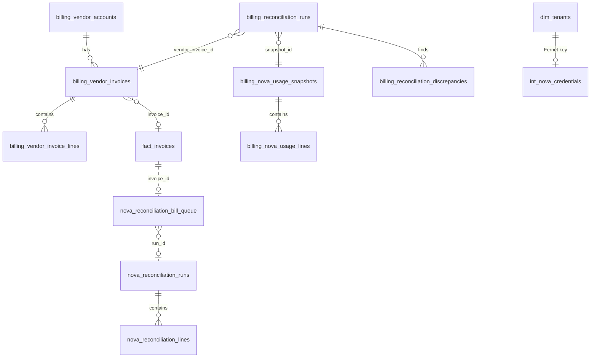
```mermaid
erDiagram
    billing_vendor_accounts ||--o{ billing_vendor_invoices : has
    billing_vendor_invoices ||--o{ billing_vendor_invoice_lines : contains
    billing_vendor_invoices }o--o| fact_invoices : "invoice_id"
    billing_nova_usage_snapshots ||--o{ billing_nova_usage_lines : contains
    billing_reconciliation_runs }o--|| billing_vendor_invoices : "vendor_invoice_id"
    billing_reconciliation_runs }o--|| billing_nova_usage_snapshots : "snapshot_id"
    billing_reconciliation_runs ||--o{ billing_reconciliation_discrepancies : finds
    nova_reconciliation_runs ||--o{ nova_reconciliation_lines : contains
    nova_reconciliation_bill_queue }o..o| nova_reconciliation_runs : "run_id"
    fact_invoices ||..o| nova_reconciliation_bill_queue : "invoice_id"
    dim_tenants ||--o| int_nova_credentials : "Fernet key"
```

### 4.8 Integrations and Tally

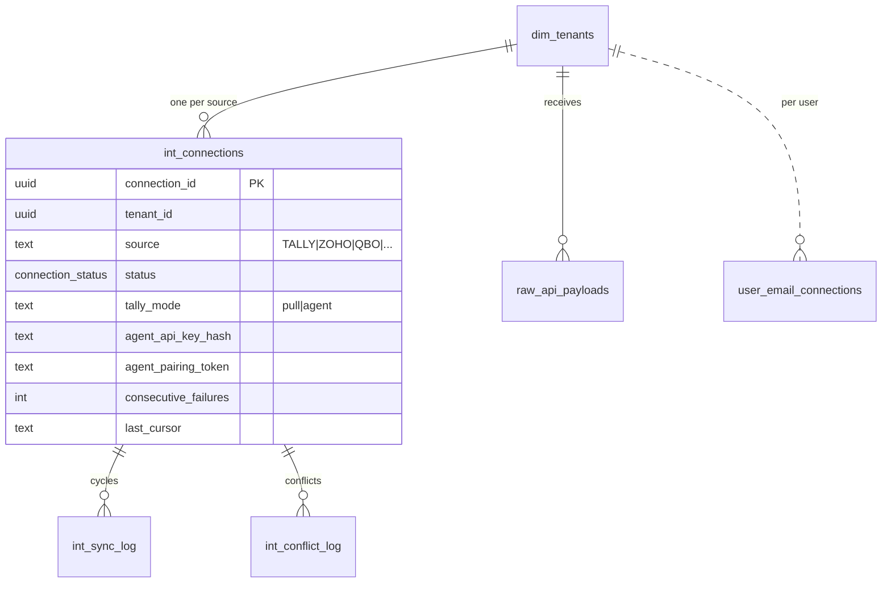
```mermaid
erDiagram
    dim_tenants ||--o{ int_connections : "one per source"
    int_connections ||--o{ int_sync_log : cycles
    int_connections ||--o{ int_conflict_log : conflicts
    dim_tenants ||--o{ raw_api_payloads : receives
    dim_tenants ||..o{ user_email_connections : "per user"

    int_connections {
        uuid connection_id PK
        uuid tenant_id
        text source "TALLY|ZOHO|QBO|..."
        connection_status status
        text tally_mode "pull|agent"
        text agent_api_key_hash
        text agent_pairing_token
        int consecutive_failures
        text last_cursor
    }
```

---

## 5. State machines

### 5.1 Upload OCR — `raw_invoice_uploads.status`

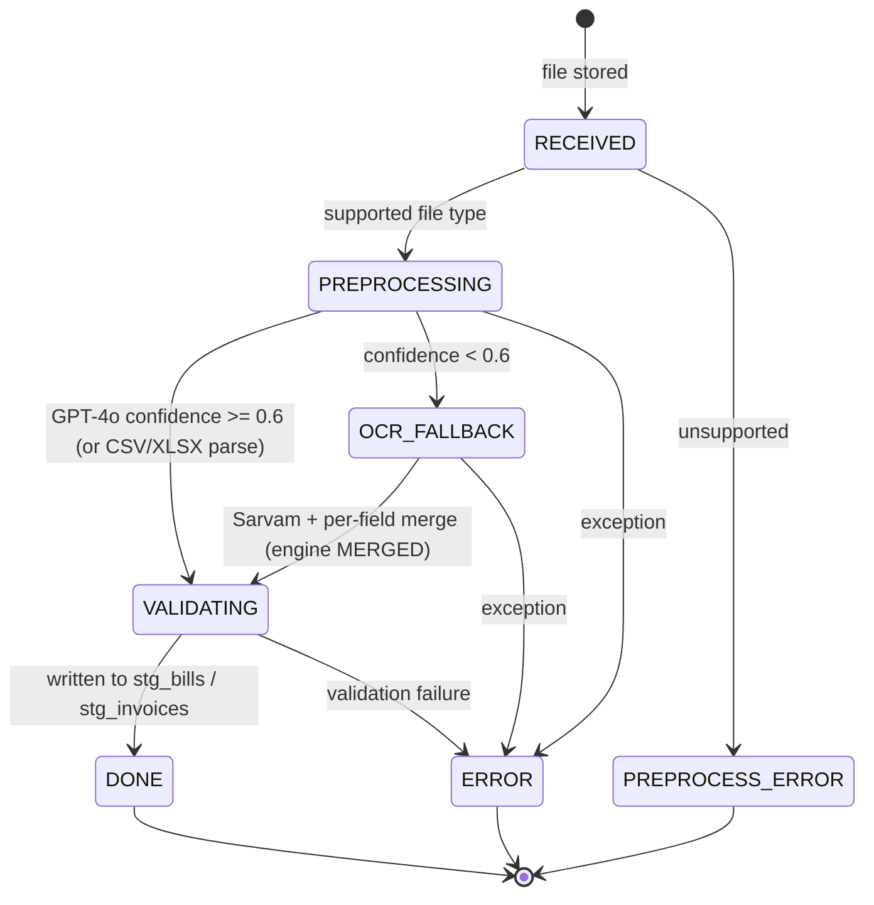
```mermaid
stateDiagram-v2
    [*] --> RECEIVED: file stored
    RECEIVED --> PREPROCESSING: supported file type
    RECEIVED --> PREPROCESS_ERROR: unsupported
    PREPROCESSING --> VALIDATING: GPT-4o confidence >= 0.6 (or CSV/XLSX parse)
    PREPROCESSING --> OCR_FALLBACK: confidence < 0.6
    PREPROCESSING --> ERROR: exception
    OCR_FALLBACK --> VALIDATING: Sarvam + per-field merge (engine MERGED)
    OCR_FALLBACK --> ERROR: exception
    VALIDATING --> DONE: written to stg_bills / stg_invoices
    VALIDATING --> ERROR: validation failure
    DONE --> [*]
    ERROR --> [*]
    PREPROCESS_ERROR --> [*]
```

Notes: `OCR_PRIMARY` exists in the enum but is never set. The API upload path (`domain/ingest.py`) writes uploads directly as `DONE` after synchronous OCR. Errors also write `raw_ingestion_errors`. Rows are claimed with `FOR UPDATE SKIP LOCKED`.

### 5.2 Staging promotion — `stg_*.sync_status`

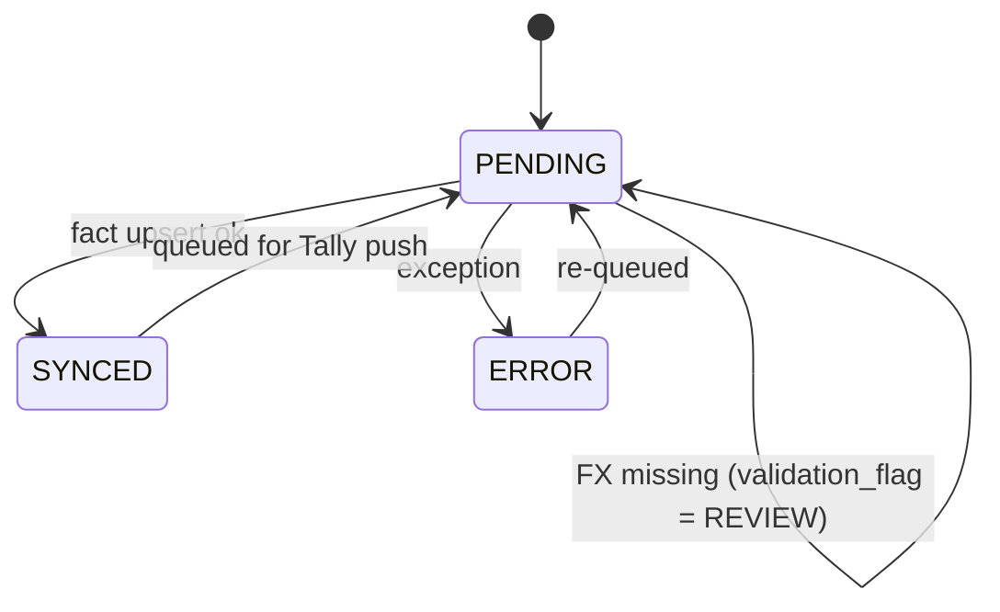
```mermaid
stateDiagram-v2
    [*] --> PENDING
    PENDING --> SYNCED: fact upsert ok
    PENDING --> PENDING: FX missing (validation_flag = REVIEW)
    PENDING --> ERROR: exception
    SYNCED --> PENDING: queued for Tally push
    ERROR --> PENDING: re-queued
```

`validation_flag`: `OK`, `MISMATCH`, `DUPLICATE`, `REVIEW`.

### 5.3 Bill approval — `fact_invoices.status`

The pending statuses are generated from the tenant's chain (`tenant_chain_config`, department-specific first, then tenant default, then `DEFAULT_APPROVAL_CHAIN`). Default chain: step 0 Submitted (member, locked) → step 1 Approver → step 2 Accountant → step 3 Finance Controller.

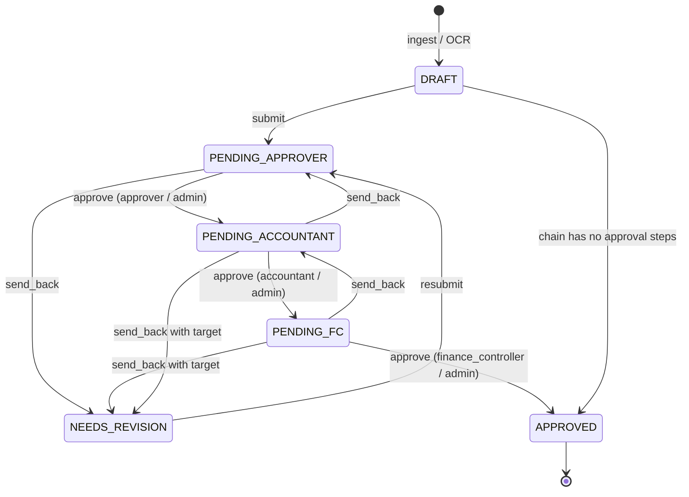
```mermaid
stateDiagram-v2
    [*] --> DRAFT: ingest / OCR
    DRAFT --> PENDING_APPROVER: submit
    NEEDS_REVISION --> PENDING_APPROVER: resubmit
    PENDING_APPROVER --> PENDING_ACCOUNTANT: approve (approver / admin)
    PENDING_ACCOUNTANT --> PENDING_FC: approve (accountant / admin)
    PENDING_FC --> APPROVED: approve (finance_controller / admin)
    PENDING_APPROVER --> NEEDS_REVISION: send_back
    PENDING_ACCOUNTANT --> PENDING_APPROVER: send_back
    PENDING_FC --> PENDING_ACCOUNTANT: send_back
    PENDING_FC --> NEEDS_REVISION: send_back with target
    PENDING_ACCOUNTANT --> NEEDS_REVISION: send_back with target
    DRAFT --> APPROVED: chain has no approval steps
    APPROVED --> [*]
```

| Action | Rule |
|---|---|
| `submit` | `DRAFT` / `NEEDS_REVISION` → first pending status |
| `approve` | next pending status, or `APPROVED` after the last step; after a multi-step send-back it jumps back to the step that sent it back |
| `send_back` | previous pending status, or `NEEDS_REVISION`; explicit `target_status` allowed (any earlier step) |
| `priority_change` | audit only |
| `recon_approve` / `recon_reject` | Nova recon decision; reject advances to next chain status |
| Who may act | the step's `role` + `admin`; if `assignees` set, also by name (admins exempt) |
| Chains > 3 steps | produce `PENDING_STEP_{n}`, **not** in the Postgres enum (known gap) |

### 5.4 Bill payment — `fact_invoices.payment_status` and `soft_status`

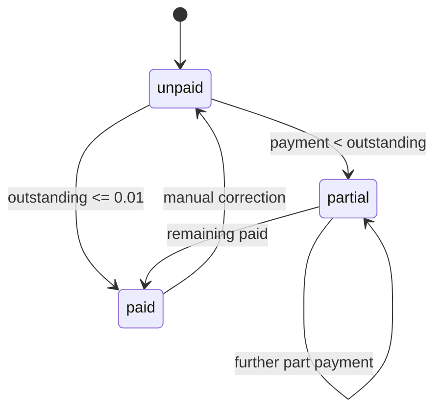
```mermaid
stateDiagram-v2
    [*] --> unpaid
    unpaid --> partial: payment < outstanding
    unpaid --> paid: outstanding <= 0.01
    partial --> paid: remaining paid
    partial --> partial: further part payment
    paid --> unpaid: manual correction
```

Writers: `POST /api/bills/{id}/payment`, bulk `MARK_PAID`, IMPS `_apply_success`, crypto `mark_confirmed`. Every change writes `bill_approval_chain` step **99** (`payment_paid` / `payment_partial` / `payment_unpaid`).

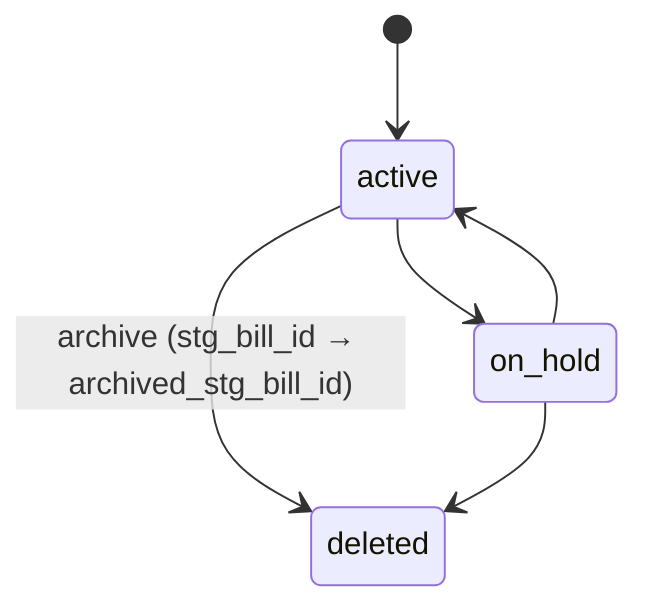
```mermaid
stateDiagram-v2
    [*] --> active
    active --> on_hold
    on_hold --> active
    active --> deleted: archive (stg_bill_id → archived_stg_bill_id)
    on_hold --> deleted
```

### 5.5 INR disbursement — `fact_disbursements.status`

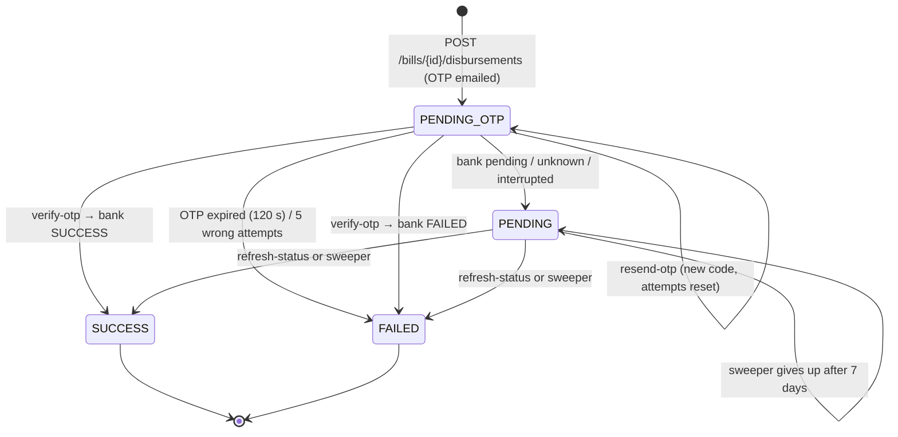
```mermaid
stateDiagram-v2
    [*] --> PENDING_OTP: POST /bills/{id}/disbursements (OTP emailed)
    PENDING_OTP --> PENDING_OTP: resend-otp (new code, attempts reset)
    PENDING_OTP --> FAILED: OTP expired (120 s) / 5 wrong attempts
    PENDING_OTP --> SUCCESS: verify-otp → bank SUCCESS
    PENDING_OTP --> FAILED: verify-otp → bank FAILED
    PENDING_OTP --> PENDING: bank pending / unknown / interrupted
    PENDING --> SUCCESS: refresh-status or sweeper
    PENDING --> FAILED: refresh-status or sweeper
    PENDING --> PENDING: sweeper gives up after 7 days
    SUCCESS --> [*]
    FAILED --> [*]
```

On `SUCCESS`: decrement `remitter_accounts.balance`, update bill `payment_status`, write step-99 row, enqueue receipt. The reconcile update is conditional (`AND status='PENDING'`) so only one caller wins.

Receipt sub-state `receipt_email_status`: `NULL` → `SENDING` (atomic claim) → `sent` / `failed` / `no_contact` / `manual_required`.

### 5.6 USDC payout — `fact_disbursements.status` / `crypto_disbursement_details.sub_status`

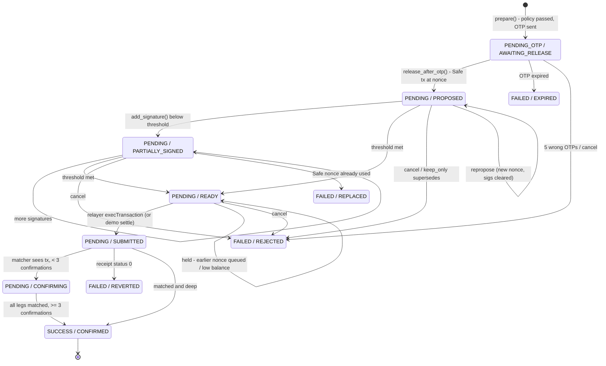
```mermaid
stateDiagram-v2
    state "PENDING_OTP / AWAITING_RELEASE" as AR
    state "PENDING / PROPOSED" as PR
    state "PENDING / PARTIALLY_SIGNED" as PS
    state "PENDING / READY" as RD
    state "PENDING / SUBMITTED" as SB
    state "PENDING / CONFIRMING" as CF
    state "SUCCESS / CONFIRMED" as OK
    state "FAILED / REJECTED" as RJ
    state "FAILED / EXPIRED" as EX
    state "FAILED / REVERTED" as RV
    state "FAILED / REPLACED" as RP

    [*] --> AR: prepare() - policy passed, OTP sent
    AR --> PR: release_after_otp() - Safe tx at nonce
    AR --> EX: OTP expired
    AR --> RJ: 5 wrong OTPs / cancel
    PR --> PS: add_signature() below threshold
    PS --> PS: more signatures
    PR --> RD: threshold met
    PS --> RD: threshold met
    RD --> SB: relayer execTransaction (or demo settle)
    RD --> RD: held - earlier nonce queued / low balance
    PR --> RJ: cancel / keep_only supersedes
    PS --> RJ: cancel
    RD --> RJ: cancel
    PR --> PR: repropose (new nonce, sigs cleared)
    PS --> RP: Safe nonce already used
    SB --> CF: matcher sees tx, < 3 confirmations
    SB --> RV: receipt status 0
    CF --> OK: all legs matched, >= 3 confirmations
    SB --> OK: matched and deep
    OK --> [*]
```

Groupings in code: `SIGNABLE = PROPOSED, PARTIALLY_SIGNED, READY`; `PRE_SUBMIT = AWAITING_RELEASE + SIGNABLE`; `NONCE_HOLDING = SIGNABLE + SUBMITTED`; `TERMINAL = SUCCESS, FAILED`. A payout `SUBMITTED` with no receipt after 30 min raises `PAYOUT_STUCK`.

### 5.7 Vendor wallet — `supplier_wallets.status`

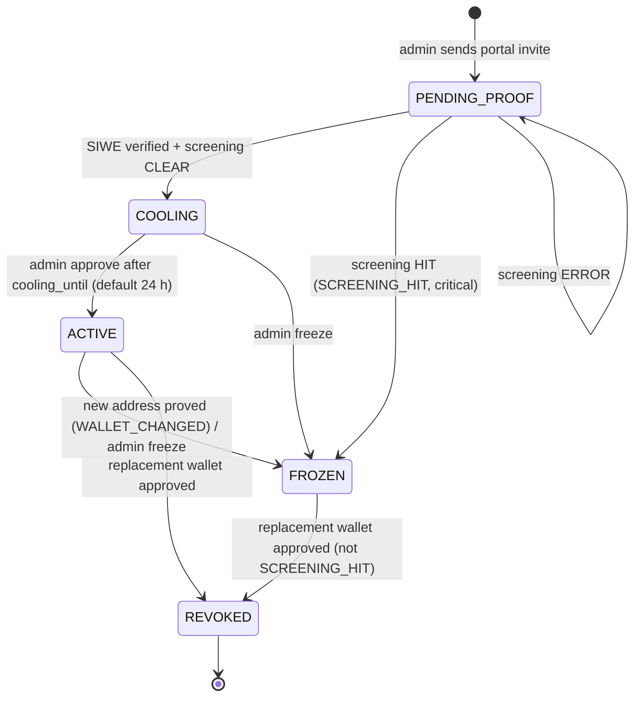
```mermaid
stateDiagram-v2
    [*] --> PENDING_PROOF: admin sends portal invite
    PENDING_PROOF --> COOLING: SIWE verified + screening CLEAR
    PENDING_PROOF --> FROZEN: screening HIT (SCREENING_HIT, critical)
    PENDING_PROOF --> PENDING_PROOF: screening ERROR
    COOLING --> ACTIVE: admin approve after cooling_until (default 24 h)
    ACTIVE --> FROZEN: new address proved (WALLET_CHANGED) / admin freeze
    COOLING --> FROZEN: admin freeze
    ACTIVE --> REVOKED: replacement wallet approved
    FROZEN --> REVOKED: replacement wallet approved (not SCREENING_HIT)
    REVOKED --> [*]
```

`screening_status`: `PENDING`, `CLEAR`, `HIT`, `ERROR`.

### 5.8 Tenant KYB (crypto onboarding) — `dim_tenants.kyb_status`

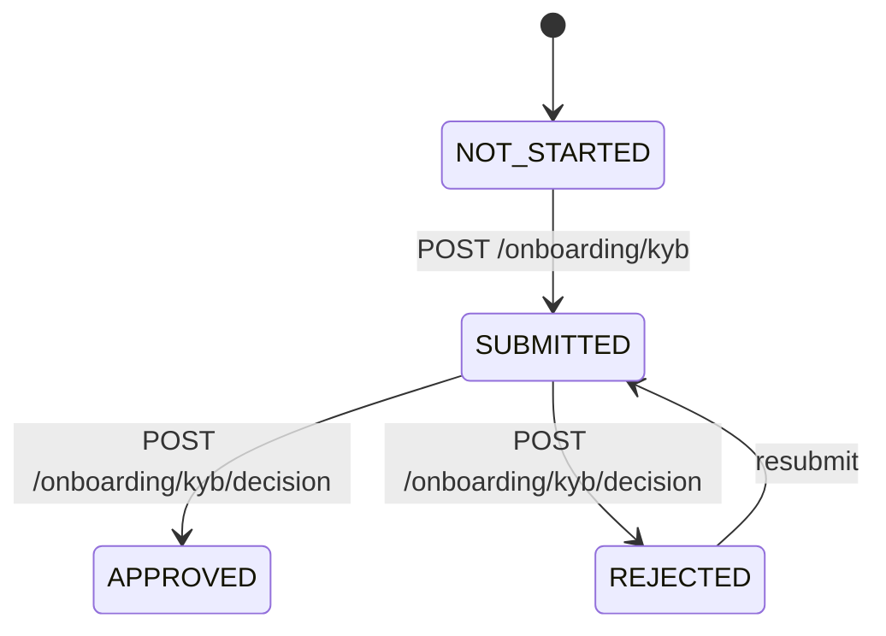
```mermaid
stateDiagram-v2
    [*] --> NOT_STARTED
    NOT_STARTED --> SUBMITTED: POST /onboarding/kyb
    SUBMITTED --> APPROVED: POST /onboarding/kyb/decision
    SUBMITTED --> REJECTED: POST /onboarding/kyb/decision
    REJECTED --> SUBMITTED: resubmit
```

### 5.9 Vendor GST / KYB — `dim_suppliers.status`

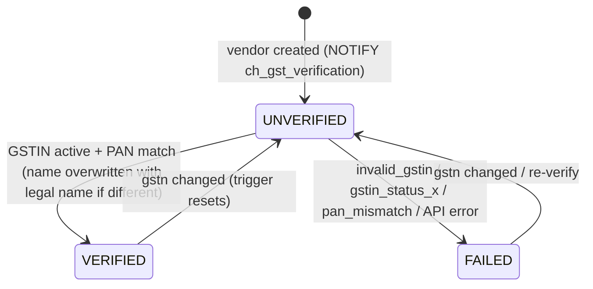
```mermaid
stateDiagram-v2
    [*] --> UNVERIFIED: vendor created (NOTIFY ch_gst_verification)
    UNVERIFIED --> VERIFIED: GSTIN active + PAN match (name overwritten with legal name if different)
    UNVERIFIED --> FAILED: invalid_gstin / gstin_status_x / pan_mismatch / API error
    VERIFIED --> UNVERIFIED: gstn changed (trigger resets)
    FAILED --> UNVERIFIED: gstn changed / re-verify
```

Disbursement requires `VERIFIED`. Bank flag `bank_verified` is three-state: `false` (not tried / transient), `true` (verified), `NULL` (definitively not found; not retried until account details change).

### 5.10 Ledger posting — `ledger_postings.status`

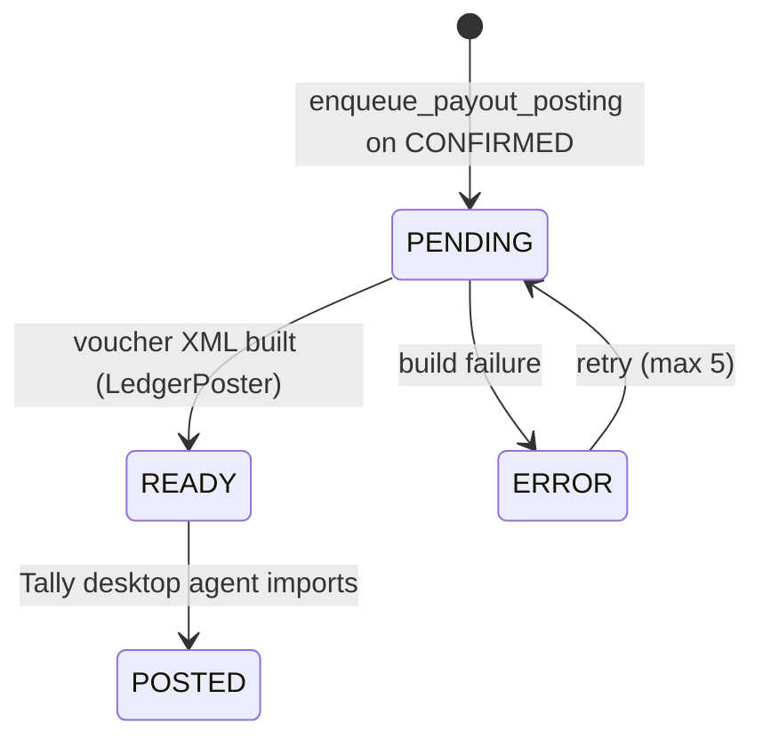
```mermaid
stateDiagram-v2
    [*] --> PENDING: enqueue_payout_posting on CONFIRMED
    PENDING --> READY: voucher XML built (LedgerPoster)
    READY --> POSTED: Tally desktop agent imports
    PENDING --> ERROR: build failure
    ERROR --> PENDING: retry (max 5)
```

### 5.11 Audit anchor — `audit_anchors.status`

```mermaid
stateDiagram-v2
    [*] --> BUILT: Merkle roots computed, rows stamped
    BUILT --> SUBMITTED: tx sent (calldata or contract mode)
    SUBMITTED --> CONFIRMED: receipt ok
    SUBMITTED --> FAILED: receipt failed (ANCHOR_FAILED finding per tenant)
    BUILT --> FAILED: submit error
```

### 5.12 Review Hub finding — `rh_findings.status`

```mermaid
stateDiagram-v2
    [*] --> OPEN: DETECTED (upsert)
    OPEN --> ACKNOWLEDGED: user
    OPEN --> SNOOZED: user (default 7 d, 1-365)
    OPEN --> RESOLVED: user (edit capability)
    OPEN --> DISMISSED: user + reason (edit capability)
    ACKNOWLEDGED --> OPEN: condition_hash changed (REDETECTED)
    SNOOZED --> OPEN: user reopen
    ACKNOWLEDGED --> RESOLVED
    ACKNOWLEDGED --> DISMISSED
    OPEN --> AUTO_RESOLVED: detector no longer asserts
    ACKNOWLEDGED --> AUTO_RESOLVED
    SNOOZED --> AUTO_RESOLVED
    RESOLVED --> [*]
    DISMISSED --> [*]
    AUTO_RESOLVED --> [*]
```

- Terminal states set `resolved_at`, freeing the partial unique key; a later re-detection inserts a new row (regression).
- Dismiss reasons: `not_an_issue`, `already_handled`, `data_is_wrong`, `not_my_job`, `never_show_type` (may create an `rh_suppressions` row: `exact_key`, `type_on_subject`, `type_tenant_wide`).
- Undo tokens live 30 s.
- Severity: `LOW`, `MEDIUM`, `HIGH`, `CRITICAL` (family `approval` forced to `MEDIUM`).
- Families: `approval`, `payment`, `vendor_identity`, `tax`, `reconciliation`, `data_quality`, `duplication`, `fx`.

### 5.13 Review request and agent run

```mermaid
stateDiagram-v2
    [*] --> PENDING: rh_review_requests insert (NOTIFY ch_review_agent)
    PENDING --> RUNNING: ReviewAgentWorker claims
    RUNNING --> DONE: findings written
    RUNNING --> FAILED
    PENDING --> SKIPPED: triage says no / budget exhausted
```

`agent_runs.status`: `RUNNING` → `SUCCEEDED` / `FAILED` / `SKIPPED` / `REFUSED`.

### 5.14 Agent draft bill — `agent_draft_bills.status`

```mermaid
stateDiagram-v2
    [*] --> pending: mailbox agent creates draft (analysis new/correction/duplicate)
    pending --> submitted: user ingests + submits on Review page
    pending --> discarded: DELETE /api/agent/drafts/{id}
```

`agent_email_events.action`: `processing`, `skipped_no_poc`, `skipped_no_pdf`, `contract_detected`, `contract_store_failed`, `skipped_not_bill`, `ocr_failed`, `skipped_duplicate`, `draft_created`.

### 5.15 Tally connection — `int_connections.status`

```mermaid
stateDiagram-v2
    [*] --> DISCONNECTED
    DISCONNECTED --> PENDING: pairing token generated
    PENDING --> ACTIVE: agent paired + first sync ok
    ACTIVE --> ERROR: cycle failed (consecutive_failures++)
    ERROR --> ACTIVE: cycle ok (failures reset)
    ACTIVE --> PAUSED
    PAUSED --> ACTIVE
    ACTIVE --> REVOKED
```

`int_sync_log.status`: `RUNNING` → `COMPLETED` / `PARTIAL` / `FAILED`.

### 5.16 Nova reconciliation

| Object | Values |
|---|---|
| `nova_reconciliation_runs.rollup_status` | `RED` (any AMBIGUOUS, UNCERTIFIED, RATE_MISMATCH, QTY_MISMATCH, Nova self-inconsistent) · `YELLOW` (NOVA_LOGIC_MISSING, UNRESOLVED_MODULE, PENDING_EXTENDED_LOOKUP, or only MISSING/EXTRA lines) · `GREEN` |
| Line `certification_status` | `CERTIFIED`, `UNCERTIFIED`, `AMBIGUOUS`, `UNRESOLVED_MODULE`, `PENDING_EXTENDED_LOOKUP`, `NOVA_LOGIC_MISSING` |
| Line `match_status` | `MATCHED`, `MISSING_IN_INVOICE`, `EXTRA_IN_INVOICE` |
| Line `rate_status` | `RATE_OK`, `RATE_MISMATCH`, `ZERO_VOLUME`, `NOT_AUTO_COMPARABLE` |
| Line `qty_status` | `QTY_OK`, `QTY_MISMATCH` |
| Attribution | `OWN`, `SIBLING_OWNED`, `SHARED`, `UNATTRIBUTED` |
| Bill queue | `PENDING` → `DONE` / `SKIPPED` / `ERROR` (retried, max 5) |
| In-repo `billing_reconciliation_runs.status` | `PENDING`, `RUNNING`, `COMPLETED`, `COMPLETED_WITH_DISCREPANCIES`, `FAILED` |
| In-repo discrepancy status | `OPEN`, `ACKNOWLEDGED`, `RESOLVED`, `DISPUTED_WITH_VENDOR`, `IGNORED` |

### 5.17 Other state columns

| Column | Values |
|---|---|
| `wf_tasks.status` / type | `PENDING`, `IN_PROGRESS`, `DONE`, `SKIPPED` / `NUDGE`, `ESCALATE`, `APPROVE`, `REVIEW`, `ALERT` |
| `wf_nudges.status` | `PENDING`, `SENT`, `FAILED`, `CANCELLED` |
| `comm_thread_state.status` | `open`, `awaiting_vendor`, `awaiting_internal`, `resolved` |
| `claims_status` (emails, vendor docs) | `PENDING`, `RUNNING`, `DONE`, `SKIPPED`, `FAILED`; claim: `PENDING` → `APPLIED` / `CONFLICTED` / `FAILED` |
| `chain_transfers.match_type` | `PAYOUT`, `TAX`, `FUNDING`, `RECEIVABLE`, `UNKNOWN` |
| `fact_payments.status` | `PENDING`, `CLEARED`, `BOUNCED`, `REFUNDED` |
| `payment_transactions.status` (legacy) | `INITIATED`, `PROCESSING`, `COMPLETED`, `FAILED`, `BOUNCED`, `REVERSED`, `CANCELLED` |
| `vendor_logos.status` | `found`, `none`, `hidden` |

---

## 6. Event triggers (LISTEN/NOTIFY)

All created by `pipelines/cdc.py:create_notify_triggers()` at pipeline start. Generic `_pipeline_notify()` fires `AFTER … FOR EACH STATEMENT` with an empty payload; trigger names follow `tg_{channel}_{table}`.

| Table(s) | Event | Channel | Listener |
|---|---|---|---|
| `raw_api_payloads` | INSERT | `ch_api_sync` | `ApiSyncWorker` |
| `raw_webhook_events` | INSERT | `ch_webhook` | `WebhookWorker` |
| `raw_invoice_uploads` | INSERT | `ch_upload_ocr` | `UploadOcrWorker` |
| `stg_invoices`, `stg_bills`, `stg_payments` | INSERT | `ch_staging_promotion` | `StagingPromotionWorker` |
| `stg_bills` | INSERT / UPDATE | `ch_tds_processing` | `TdsProcessingWorker` |
| `fact_invoices` | INSERT | `ch_category_enrichment` | `CategoryEnrichmentWorker` |
| `fact_invoices` | INSERT | `ch_deduplication` | `DeduplicationWorker` |
| `dim_suppliers`, `dim_end_customers` | INSERT | `ch_gst_verification` | `GstVerificationWorker` |
| `dim_suppliers`, `dim_end_customers`, `supplier_bank_accounts` | INSERT | `ch_bank_verification` | `BankVerificationWorker` (disabled) |
| `fact_invoices`, `stg_bills`, `dim_suppliers`, `supplier_gstins`, `ai_anomalies`, `billing_reconciliation_discrepancies`, `payment_transactions`, `fact_disbursements`, `raw_invoice_uploads`, `mapping_review_queue` | INSERT / UPDATE | `ch_review_adapters` | `ReviewAdapterWorker` (API process) |
| `fx_rate_alerts` | INSERT | `ch_review_adapters` | same |
| `rh_review_requests` | INSERT | `ch_review_agent` | `ReviewAgentWorker` |
| `poc_email_messages`, `vendor_documents` | INSERT | `ch_comm_extract` | `CommExtractionWorker` |

Reset triggers (BEFORE UPDATE, row-level):

| Trigger | Fires on | Effect |
|---|---|---|
| `tg_gst_reset_suppliers` | `dim_suppliers.gstn` | `status = 'UNVERIFIED'`, notify `ch_gst_verification` |
| `tg_gst_reset_customers` | `dim_end_customers.gstin` | `kyc_status = 'PENDING'`, notify |
| `tg_bank_reset_suppliers` | `dim_suppliers.bank_account/bank_ifsc` | `bank_verified = false`, notify `ch_bank_verification` |
| `tg_bank_reset_customers` | `dim_end_customers.bank_account_no/bank_ifsc` | same |
| `tg_bank_reset_sba` | `supplier_bank_accounts.account_number/ifsc` | `verified = false`, notify |
| `trg_wf_audit_hash_chain` | BEFORE INSERT on `wf_audit_log` | per-tenant `seq`, `prev_hash`, `row_hash = sha256(prev ‖ canonical)` under `pg_advisory_xact_lock` |

Explicit `pg_notify` calls in app code: `ch_review_adapters` (vendor documents, vendors, review hub rescan, comm extraction), `ch_review_agent` (review hub), `ch_comm_extract` (vendor documents, payload `doc_id`), `ch_gst_verification` (vendor GSTIN re-verify).

---

## 7. Multi-tenancy in the data layer

```mermaid
flowchart LR
    JWT[JWT claim tenant_id / company_id / org_id] --> CTX[contextvar via auth_context]
    CTX --> RT[require_tenant in handler]
    RT --> Q["SQL: ... AND tenant_id = %s"]
    Q --> PG[(Postgres - no RLS)]
    W[Background workers] -->|all tenants unless PIPELINE_TENANT_ID set| PG
```

- Almost every business table has `tenant_id uuid NOT NULL`. Older tables have a real FK to `dim_tenants`; most newer tables (disbursements, approval chain, crypto, vendor satellites) do not.
- `users` keys the tenant as `company_id` (no FK).
- Global (non-tenant) tables: `dim_currencies`, `dim_fx_rates`, `fx_snapshots`, `wallet_screenings`, `chain_watch_cursors`, `int_connector_limits`, `service_catalog`, `agent_registry`, `audit_anchors`, `platform_*`. `chain_transfers.tenant_id` and `raw_webhook_events.tenant_id` are nullable.
- **Enforcement is application-only.** There is no Postgres Row-Level Security.
- The audit hash chain is per tenant (`seq` per `tenant_id`, per-tenant salts and roots).

---

## 8. Known data-model issues

| # | Issue | Effect |
|---|---|---|
| 1 | Approval chains > 3 steps produce `PENDING_STEP_{n}`, not in `invoice_status` enum | Insert/update fails for long chains |
| 2 | `OCR_PRIMARY` never set | Status dashboards never show it |
| 3 | `fact_bills` vs `fact_invoices` duplication | Confusion; `fact_invoices` is the record of truth |
| 4 | Many newer tables lack FKs | No referential integrity at DB level |
| 5 | No RLS | Tenant isolation depends entirely on code + tests |
| 6 | `models/enums.py` out of date (`DataSource`, `InvoiceStatus`, `ConnectionStatus`, `WfEntityType`, `BillingDiscrepancyType`) | Python enums disagree with DB |
| 7 | `dim_cost_centres` vs `cost_centers` | Two cost-centre tables |
| 8 | `supplier_gstns` (legacy) vs `supplier_gstins` | Two GSTIN tables |
| 9 | `users` vs `org_users` | Two user models |
| 10 | `withholding_remittances` never written | Remittance tracking missing |
| 11 | `dim_tenants.pipeline_enabled` not read by any worker | Env var `PIPELINE_TENANT_ID` still controls scope |
| 12 | Licensing cache invalidation via `pg_notify` described but not implemented | Entitlement changes take up to 300 s |
| 13 | Password-reset OTP held in memory (`_otp_store`) | Lost on restart; breaks with >1 replica |
